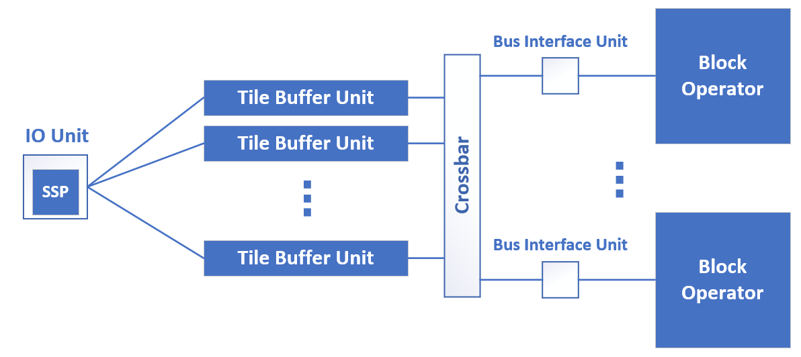

# IPU-Sim
Image Processing Unit的仿真器实现。
## 算法设计
### HDR+算法
HDR+算法的核心部分（不包括用于控制镜头采集图像的前处理操作和用于输出实际展示效果的后处理操作）我们认为由4层高斯金字塔下的光流法对齐，快速傅里叶变换(FFT)，时域合成，空域去噪，快速傅里叶逆变换(IFFT)构成。

> **存在的问题**：HDR+将图片“认为”是单通道的，实际上是以Bayer格式存储下限制最小操作像素级别（间隔2个像素计算）来实现的，对于[R,G,B]格式存储的图片格式，需要找到对应解决方案。

期望应用场景为4K图像能达到60帧/秒的输出速度，图像数据的输入输出数据流分析如下：
```
Image_4th[4][2160][4096] ---> Gaussian Blur & Downsampling 4x ---> Image_3rd[4][1080][2048]
Image_3rd[4][1080][2048] ---> Gaussian Blur & Downsampling 4x ---> Image_2nd[4][540][1024]
Image_2nd[4][540][1024] ---> Gaussian Blur & Downsampling 4x ---> Image_1st[4][270][512]

// Image 0 and Image 1 alignment
Image_1st[0][270][512], Image_1st[1][270][512] ---> 2x2 Block Matching in Search Area[15,15]   ---> Offset[][]
Image_2nd[0][540][1024], Image_2nd[1][540][1024] ---> 4x4 Block Matching in Search Area[13,13]   ---> Offset[][]
Image_3rd[0][1080][2048], Image_3rd[1][1080][2048] ---> 8x8 Block Matching in Search Area[11,11]   ---> Offset[][]
Image_4th[4][2160][4096], Image_4th[1][2160][4096] ---> 16x16 Block Matching in Search Area[5, 5]   ---> 256*135*[16, 16] sheets of Image_4th[1]

// Image 0 and Image 2 alignment
Image_1st[0][270][512], Image_1st[2][270][512] ---> 2x2 Block Matching in Search Area[15,15]   ---> Offset[][]
Image_2nd[0][540][1024], Image_2nd[2][540][1024] ---> 4x4 Block Matching in Search Area[13,13]   ---> Offset[][]
Image_3rd[0][1080][2048], Image_3rd[2][1080][2048] ---> 8x8 Block Matching in Search Area[11,11]   ---> Offset[][]
Image_4th[4][2160][4096], Image_4th[2][2160][4096] ---> 16x16 Block Matching in Search Area[5, 5]   ---> 256*135*[16, 16] sheets of Image_4th[2]    

// Image 0 and Image 3 alignment
Image_1st[0][270][512], Image_1st[3][270][512] ---> 2x2 Block Matching in Search Area[15,15]   ---> Offset[][]
Image_2nd[0][540][1024], Image_2nd[3][540][1024] ---> 4x4 Block Matching in Search Area[13,13]   ---> Offset[][]
Image_3rd[0][1080][2048], Image_3rd[3][1080][2048] ---> 8x8 Block Matching in Search Area[11,11]   ---> Offset[][]
Image_4th[4][2160][4096], Image_4th[3][2160][4096] ---> 16x16 Block Matching in Search Area[5, 5]   ---> 256*135*[16, 16] sheets of Image_4th[3]

4*256*135*[16, 16] sheets ---> DFT ---> 8*256*135*[16, 16] sheets
8*256*135*[16, 16] sheets ---> Temporal Merge ---> 2*256*135*[16, 16] sheets
2*256*135*[16, 16] sheets ---> Spatial Denoising ---> 2*256*135*[16, 16] sheets
2*256*135*[16, 16] sheets ---> IFFT ---> Output Image[2160][4096]
```
分析谷歌专利后，发现Sheet Generator(SHG)实现的“Upsamling”和“Downsampling”并不是真正意义上的升降采样，仅仅是切分sheet的一种方式，因此要进行高斯金字塔降采样必须要在STP内进行，出于对变量控制的考虑，为了保证金字塔的每层变量能够存储在不同LBP中以方便变量存储，对于3次高斯核卷积+降采样应该分布在3个STP内完成。
> **存在的问题**：该设计可能会导致负载均衡问题，显而易见地，在块匹配(Block Matching)和FFT/IFFT阶段计算量明显高于高斯核卷积+降采样计算量，后续可能会进行调整。

Kernel之间的数据依赖可以用有向无环图来表示：


因此目前设计的Kernel和STP的对应关系如下图所示。


### 直方图均衡化
1. RGB数据通过DMA读取到Line Buffer内，需按颜色通道划分开；
   - [ ] 存储在同一个Line Buffer内？不同Line Buffer内？
2. RGB图像数据分开传送至多个核；
3. 至少3个核分别统计R/G/B数据；
4. 结果(256 * 32bit int数据)存放到Data Memory中；
5. Scalar计算32位乘法+除法，并留存前缀和，共需要至少255次加法，256次乘法+除法；
   - [ ] 可以交由Core矩阵做？
6. Scalar计算结果写回Data Memory；
7. 图像数据进行查表更新写回操作。

### 矩阵乘法

## IPU架构设计
IPU总体结构如下图所示，Tile Buffer Unit (TBU)是数据的中转站，Block Operator (BLO)是实际的运算单元，两者之间通过NoC连接起来，在简单实现中NoC通过Crossbar方式实现。


数据从DRAM中读取到Shared Segment Pool (SSP)后，不同的核函数(Kernel)会分布到BLO上进行运算，Kernel的分布和。我们认为Line Buffer Pool需要承担GPU中显存的任务，所以DRAM与Line Buffer Pool以及卷积算子所需的存放在DRAM中的权重数据的搬移是由CPU指令负责(即启Kernel时传入)。
### 存储层次结构
存储层次结构设计如下图所示：

程序员管理的数据存储层次主要分为3部分：
- Tile Buffer Unit
  - 每个LBP由1至多个Line Buffer Interface管理其中变量的格式
  - 分8个大Bank，每个Bank有一定大小(Google为16KB)的存储空间
- Data Memory
  - 每个Scalar Processor旁放置的一块数据存储区域
- 2D Register File
  - Shiftable Register File：可shift的寄存器堆，共20\*20\*4个
  - Register File：PE内寄存器，目前暂时认为16个
  - Line Shared RAM：与2D RF相连，目前认为是SRAM的模式（是否有可能做成crossbar的寄存器堆？）

### 控制逻辑
指令根据执行单元的不同，有多个执行单元参与指令的实际执行，具体见[指令设计文档](https://shimo.im/sheets/DDWdd9GRtVQjjkpJ/ec8Zj)。

对于以下部件，需要有：
- Tile Buffer Interface
  - LBP虚拟地址转换
  - LBP内读写指针的管理和数据的更新(pop操作)
  - 接受更新读指针位置的命令并执行
- SHG I/O Unit
  - 有带取模运算的32位运算单元用于地址计算
  - 管理COL指向区域，对于完成读写的数据pop出去
- Operand Collector
  - 合并PE的读写请求，需求32位运算单元进行地址计算
  - 原子操作，用于直方图等统计操作的更新
- Shifter
  - 接受shift操作指令并实际控制2D RF进行shift操作
- LD/ST Unit
  - 每个PE都有的load store单元，用于接受load store指令

## IPU-Sim实现逻辑
IPU-Sim主要分为n个模块：IPU内部存储和LPDDR的传输通道和DMA控制中心Image Conveyor（IMC），用于缓存运算流程的中间结果的存储单元Slice Buffer（SLB），用于处理向量运算的Square Processor(SQP)和上述两者之间传输数据的桥梁Square Conveyor(SQC)。
### 与Google PVC的功能设计对照
Google PVC Name|Ours|Differences
-|-|-
Macro I/O Unit|IO Unit|
Line Buffer Unit (Pool)|Tile Buffer Unit (Pool)|
Sheet Generator|Bus Interface Unit|NoC为Crossbar实现，BIU工作量会更少一点
Stencil Processor|Block Operator|

### 类的设计
- class IOUnit
  - 信息存储：LPDDR基地址，SLB基地址表
  - 数据存储：无
  - 功能：LPDDR与SLB之间的LD/ST
  - 执行指令：LPDDR与SLB之间的LD/ST
  - 指令buffer：有
- class TileBuffer
  - 信息存储：SLB索引
  - 数据存储：一维数据存储，用于存储图像/权重数据
  - 功能：存储运算流程中间结果
  - 执行指令：无
  - 指令buffer：无
- class BusInterfaceUnit
  - 信息存储：SLB基地址表，SQC索引
  - 数据存储：二维数据存储In/Out/Weight Buffer，用于切片后的存储图像/权重数据
  - 功能：负责`SLB<--->SQC<--->SQP.RF`之间的LD/ST
  - 执行指令：SLB与SQC之间的LD/ST，SQC与SQP之间的LD/ST
  - 指令buffer：无
- class BlockOperator
  - 信息存储：SLB基地址表，SQC索引
  - 数据存储：二维数据存储In/Out/Weight Buffer，用于切片后的存储图像/权重数据
  - 功能：ALU，RF指令
  - 执行指令：SLB与SQC之间的LD/ST，SQC与SQP之间的LD/ST
  - 指令buffer：有

## TODO List
#### 算法&指令Part
- [ ] FFT、块匹配、矩阵乘法算法在架构上的指令实现
- [ ] 直方图、卷积算法在架构上的指令优化
- [x] 32位指令是否满足需求？
   - ~~若满足，可通过同时发射两条指令来实现需要同时执行的指令~~
   - 不满足，需要使用VLIW，并把RISC-V作为Scalar字段；或
#### 架构Part
- [ ] Memory Model组织
- [ ] 尽量以硬件cover住指令发射问题
#### 仿真器Part
- [ ] 统计Pipeline指令执行/阻塞情况，提供可视化的统计信息
- [ ] 统计能耗，各级访存(DRAM, SRAM, REG)情况，计算单元运行情况，提供可视化的统计信息
